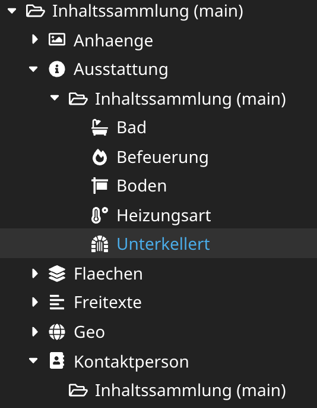
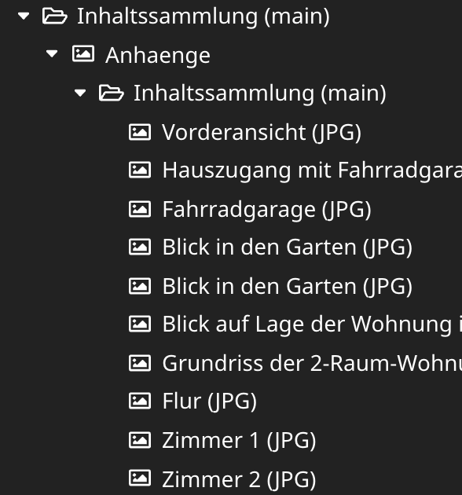

# OpenImmo extension for NEOS CMS

[](https://packagist.org/packages/ujamii/openimmo-neos)

OpenImmo and the OpenImmo logo are registered trademarks of the [OpenImmo e.V.](http://www.openimmo.de)
Neither is this package an official distribution nor am I associated with this organisation!

This NEOS package uses the [openImmo API](https://github.com/ujamii/openimmo) to generate everything NEOS
needs to work with this data. All the code is generated:
- all yaml config files (NodeTypes)
- fusion files for accesssing the properties and childnodes
- fusion files in [Atomic Design](https://bradfrost.com/blog/post/atomic-web-design/) style. Mainly to be overwritten by your own styles

As a result, you will have a load of special new content elements to be used inside the new document type.
You can use NEOS to create/edit the data or import it from a OpenImmo export archive.

The content tree might look like this:




## TODOs / contributions

If you like the features listed below, or maybe some your own additions, feel free to fork and open a pull request.

- [ ] the UPDATE xml action does not delete things at the moment 
- [ ] currently, the package uses the German OpenImmo labels for everything, so make use of default NEOS translation features
- [ ] export data into xml/zip format

## Installation

```shell
composer req ujamii/openimmo-neos
```

## Usage

1. Install composer package.
2. (optional) Create root node for import (see below)
3. Done :-)

### Importing OpenImmo XML into the NEOS Content Repository

Importing new data assumes you have zip file(s) located on your server filesystem. The import command
will extract the zip file(s) into a new folder, parse the xml and update the content repository.

In your document tree, **you have to create an import root document node**. This node will be the root
object for all the imported data. 

```shell
./flow openimmo:import
```

The sourceFolder is `import/` by default. The command expects *.zip file(s) in that directoy. 
The content will be extracted into a new directory with the
same name as the zip file and the archive will be deleted after the import is done (also the deflated directory).

The command **does not check** the content in any way. Every zip file is expected to contain exactly one xml file.

### Possible customizations

#### Icons and labels

Please have a look at `./Configuration/Settings.yaml`. You can see how icons and labels for the different
content node types may be adjusted. You have to re-generate the package files with the command below.

#### Templates

The fusion view for the root element is pretty basic, so will probably want to overwrite it:

```neosfusion
prototype(Ujamii.OpenImmo:Document.OpenImmoRoot) < prototype(Neos.Fusion:Component) {
    renderer = 'Bitte eine Immobilie im Baum auswählen!'
}
```

If you want to adjust the renderen of the single content elements, just overwrite them as you like.
All the rendering is done with the files located in `Resources/Private/Fusion/Component/Molecule`.

#### Import settings

You can customize the source directory for the import (where the zip files are located) and the default
root node (by node type) to which the data will be imported.

### Update code based on newer API classes 

1. Update the composer package, including dev packages AND `--optimize-autoloader`, otherwise the class loading will fail!
2. `./flow openimmo:generate` will fill the `Configuration/` and `Resources/Private/Fusion` directories with new files. 

## License and Contribution

[GPLv3](LICENSE)

As this is OpenSource, you are very welcome to contribute by reporting bugs, improve the code, write tests or 
whatever you are able to do to improve the project.

If you want to do me a favour, buy me something from my [Amazon wishlist](https://www.amazon.de/registry/wishlist/2C7LSRMLEAD4F).
